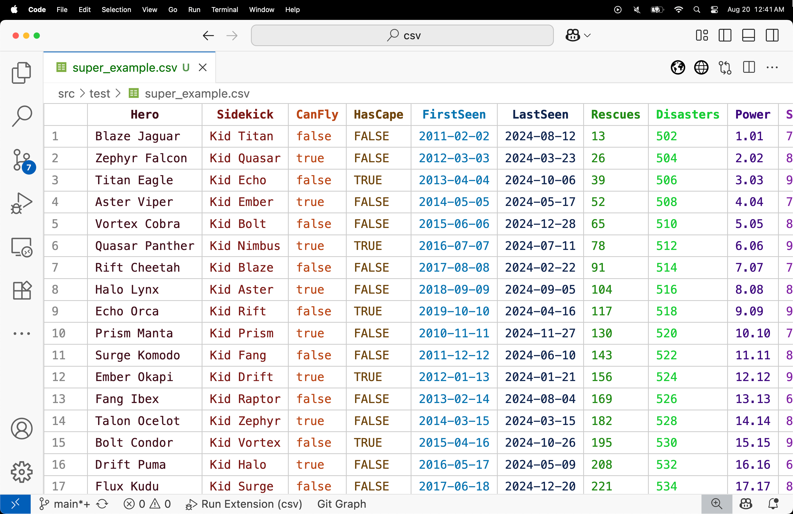

# **CSV**

**Seamlessly Display and Edit CSVs in Visual Studio Code**

---

## **Features**

- **Edit Cells Directly:** Click on any cell to edit its content in place. Changes are saved automatically to your CSV file.
- **Smart Column Resizing:** Column widths adjust automatically based on the length of the content for better readability.
- **Dynamic Color Coding:** Columns are color-coded to distinguish them visually. Colors adapt to your light or dark theme.
- **Sticky Headers:** The first row (header) remains visible as you scroll, ensuring column titles are always accessible.
- **Optimized for Themes:** Colors and styles are tailored to match your current VS Code theme (light or dark mode).
- **Improved Navigation:**
  - **Tab Navigation:** Press `Tab` to move horizontally to the next cell. Automatically wraps to the next row if necessary.
  - **Shift + Tab:** Navigate backward to the previous cell.
- **Preserves CSV Integrity:** All edits strictly adhere to the CSV format without adding extra characters or spaces.
- **Enhanced Readability:** 
  - Consistent row and header coloring.
  - Mid-tone gridlines (`#ccc`) for a clean, organized look.
- **Clipboard Integration:** Copy selected cells as CSV directly to the clipboard using `Ctrl + C` (or `Cmd + C` on macOS).
- **Column Type Detection:** Automatically detects and highlights data types (e.g., boolean, date, float, integer, etc.) with corresponding color codes.
- **Efficient Multi-Cell Selection:** Click and drag or use `Shift + Click` to select a range of cells for copying.
- **Error-Free Editing:** Handles special characters like quotes, commas, and backslashes correctly during editing.

---

## **Screenshots**

---

## **Getting Started**

### **1. Install the Extension**

- Open Visual Studio Code.
- Go to the Extensions view (`Ctrl+Shift+X` or `Cmd+Shift+X` on macOS).
- Search for **`CSV`** and click **Install**.

### **2. Open a CSV File**

- Open any `.csv` file in Visual Studio Code.
- The file will automatically use the **CSV** editor.

### **3. Edit Cells**

- **Click to Edit:** Click on any cell to start editing. After making changes:
  - Press `Enter` or click outside the cell to save.
- **Keyboard Navigation:**
  - Press `Tab` to move to the next cell (wraps to the next row if necessary).
  - Press `Shift + Tab` to move to the previous cell.

### **4. Scroll and View**

- Use the mouse or keyboard to scroll. The header row stays fixed for reference.

### **5. Theme Support**

- Switch between light and dark themes in VS Code to see how column colors adapt for readability.

---

## **Known Issues**

- **Copy:** Copying a group of cells sometimes fails.
- **Large CSV Files:** Performance might degrade for files with thousands of rows. Best suited for medium-sized datasets.

---

## **Planned Improvements**

- **Insert Row Or Column**
- **Drag-and-Drop Support:** Move rows or columns dynamically.

---

## **Release Notes**

### **v1.0.5**
- **New:** Multi-cell selection and `Shift + Click` for selecting a range of cells.
- **Enhanced:** Clipboard integration for copying selected cells as CSV directly.
- **Improved:** Better handling of special characters like quotes, commas, and backslashes during editing.
- **Added:** Column type detection and color-coded highlighting for boolean, date, float, integer, and string types.
- **Refined:** Optimized update mechanism for external document changes without disrupting user edits.

### **v1.0.2**
- **Improved:** Smooth activation of editing mode when clicking on cells.
- **Fixed:** `Tab` and `Shift + Tab` navigation now works seamlessly across rows and columns.
- **Updated:** Sticky headers now have a consistent background color matching the theme.

### **v1.0.1**
- **Enhanced:** Auto-sizing columns based on content length.
- **Fixed:** Persistent cell coloring and improved gridlines for better readability.

### **v1.0.0**
- Initial release with editable fields, sticky headers, automatic column sizing, and adaptive themes.

---

## **Support**

Encountered an issue? Have a suggestion? Let us know!

- Open an issue on [GitHub](https://github.com/jonaraphael/csv.git/issues).

---

## **License**

This extension is licensed under the [MIT License](https://opensource.org/licenses/MIT).
