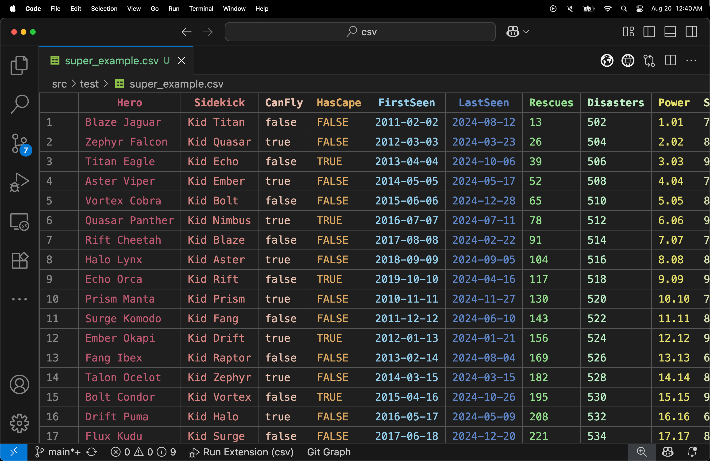

# **CSV**

Experience a whole new way to work with CSV files right inside VS Code. CSV transforms your CSV files into an interactive, spreadsheet-like experience—making it effortless to view, edit, and navigate your data with precision and speed.

---

## Why CSV?

Working with CSV files shouldn’t be a chore. With CSV, you get:

- **Direct In-Place Editing:** Click on any cell to edit its content seamlessly. Your changes can be saved immediately to the CSV file, ensuring data integrity without extra steps.
- **Smart Column Sizing & Dynamic Color Coding:** Columns automatically adjust to fit content while being visually distinguished by data type. Whether it’s boolean, date, integer, float, or text, each column gets its own adaptive color that adjusts for light and dark themes.
- **Sticky Headers & Fluid Navigation:** Keep your header row always visible as you scroll. Effortlessly move through cells using intuitive keyboard shortcuts like `Tab`, `Shift + Tab`, and arrow keys—just like a full-featured spreadsheet.
- **Efficient Multi-Cell Selection & Clipboard Integration:** Select a range of cells with click-and-drag and copy them as well-formatted CSV data using `Ctrl/Cmd + C`.
- **Robust Data Handling:** Leveraging the power of [Papa Parse](https://www.papaparse.com/), the extension handles complex CSV structures, special characters, and various data types gracefully.
- **Theme-Optimized Interface:** Whether you prefer light or dark mode, CSV automatically adapts its styles for an optimal viewing experience.

---

## Features

- **Interactive Editing:** Double-click any cell to edit, with automatic save on blur.
- **Smart Resizing:** Automatic calculation of column widths for improved readability.
- **Dynamic Color Coding:** Visual cues based on data type help you quickly identify numbers, dates, booleans, and more.
- **Sticky Headers:** Keep column titles in view as you scroll through large datasets.
- **Enhanced Keyboard Navigation:** Navigate cells with Tab/Shift+Tab and use keyboard shortcuts for quick editing, saving, and selection.
- **Advanced Multi-Cell Selection:** Easily select and copy blocks of data, then paste them elsewhere as properly formatted CSV.
- **Find & Highlight:** Built-in find widget helps you search for text within your CSV with real-time highlighting and navigation through matches.
- **Preserved CSV Integrity:** All modifications respect CSV formatting—no unwanted extra characters or formatting issues.
- **Optimized for Performance:** Designed for medium-sized datasets, ensuring a smooth editing experience without compromising on functionality.

---

## Screenshots

---

## Getting Started

### 1. Install the Extension

- Open Visual Studio Code.
- Go to the Extensions view (`Ctrl+Shift+X` or `Cmd+Shift+X` on macOS).
- Search for **CSV** and click **Install**.

### 2. Open a CSV File

- Open any `.csv` file in VS Code.
- The CSV will automatically load, presenting your file in an interactive grid view.

### 3. Edit and Navigate

- **Click to Edit:** Double-click any cell to edit its content. Simply press `Enter` or click outside the cell to save.
- **Keyboard Navigation:** Use `Tab`/`Shift+Tab` to move horizontally between cells. Navigation also wraps to the next or previous row as needed.
- **Multi-Cell Selection:** Click and drag or use `Shift + Click` to select multiple cells, then copy them as CSV using `Ctrl/Cmd + C`.
- **Find & Highlight:** Press `Ctrl/Cmd + F` to activate the find widget and quickly locate data within your CSV.

---

## Planned Improvements

- **Row and Column Insertion/Deletion:** Quickly add or remove rows or columns without leaving the editor.

---

## Release Notes

### v1.0.6
- **New:** Multi-cell selection with intuitive `Shift + Click` support.
- **Enhanced:** Clipboard integration for copying selected cells as clean, CSV-formatted text.
- **Improved:** Navigation and editing, including better handling of special characters like quotes and commas.
- **Added:** Advanced column type detection with dynamic color-coded highlighting.
- **Refined:** Update mechanism for external document changes without interrupting your workflow.

### v1.0.2
- **Improved:** Seamless activation of editing mode on double-click.
- **Fixed:** `Tab` and `Shift + Tab` navigation issues, ensuring smooth cell-to-cell movement.
- **Updated:** Sticky header styling now consistently matches the active theme.

### v1.0.0
- **Initial Release:** Introduced a full-featured CSV with interactive cell editing, smart column sizing, and adaptive theme support.

---

## Support

Have questions, suggestions, or encountered an issue?  
- Open an issue on [GitHub](https://github.com/jonaraphael/csv/issues) and let us know how we can help!

---

## License

This extension is licensed under the [MIT License](https://opensource.org/licenses/MIT).
